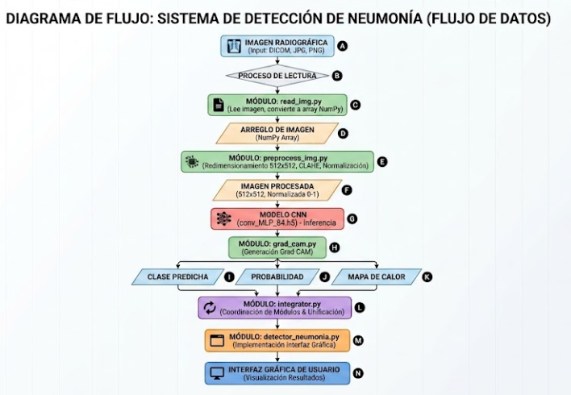

## Detección de Neumonía mediante Deep Learning


Aplicación diseñada para analizar radiografías torácicas a través de técnicas de aprendizaje profundo, con la finalidad de ayudar en la categorización de imágenes en tres grupos:

Neumonía de origen bacteriano.
Neumonía de origen viral.
Sin presencia de neumonía.

El sistema posibilita que se suban y muestren imágenes de radiográficas en los formatos PNG, JPG, JPEG y DICOM. Después, las imágenes se preprocesan a través de una serie de pasos: se les cambia el tamaño a 512 × 512 píxeles, se convierten a escala de grises, se les aplica ecualización adaptativa usando CLAHE y finalmente se normalizan sus valores en un rango entre 0 y 1. Una vez que se finaliza este procedimiento, una red neuronal convolucional (CNN) examina la imagen y produce una predicción junto con la probabilidad vinculada a la clase detectada.

Asimismo, la aplicación incluye el uso de Grad-CAM para crear mapas de calor, que destacan las áreas de la radiografía que tuvieron más impacto en la categorización hecha por el modelo.
---
## Objetivo
Integrar técnicas de aprendizaje profundo y tratamiento de imágenes en una aplicación modular, que se pueda mantener y reproducir, para la categorización de radiografías torácicas.

El proyecto organiza cada función en módulos independientes y asegura que cada uno de ellos asuma una tarea concreta, evitando así la excesiva dependencia entre ellos.

## Funcionalidades
Se pueden documentar funcionalidades como:

- Carga de imágenes radiográficas.
- Lectura de imágenes en formato DICOM.
- Lectura de imágenes JPG, JPEG y PNG.
- Visualización de la imagen cargada.
- Preprocesamiento de imágenes a una resolución de 512 × 512 píxeles.
- Conversión a escala de grises.
- Aplicación de CLAHE.
- Normalización de la imagen.
- Predicción mediante un modelo de aprendizaje profundo.
- Clasificación en neumonía bacteriana, neumonía viral o sin neumonía.
- Generación de mapas de calor mediante Grad-CAM.
- Visualización de la clase predicha y su probabilidad.
- Registro de resultados.

### Estructura y módulos del proyecto
La arquitectura del sistema se diseñó con un enfoque modular. Esto es decir, en términos de diseño, cada archivo tiene una única y bien delimitada finalidad, evitando mezclar distintas lógicas o funciones en un mismo lugar.

```text
UAO-Neumonia-Grupo-7/

─ src/
 ─ detector_neumonia.py
 ─ integrator.py
 ─ read_img.py
 ─ preprocess_img.py
 ─ load_model.py
 ─ grad_cam.py

─ test/
  ─ test_detector_neumonia.py
  ─ test_grad_cam.py
  ─ test_integrator.py
  ─ test_load_model.py
  ─ test_preprocess_img.py
  ─ test_read_img.py

─ DICOM/
 ─ JPG/
 ─ assets/
   ─ flujo_datos.png

─ Dockerfile
─ pyproject.toml
─ uv.lock
─ .gitignore
─ LICENSE
─ README.md
```

| Módulo | Responsabilidad |
| --- | --- |
| `detector_neumonia.py` | Contiene el diseño de la interfaz gráfica utilizando Tkinter. Los botones llaman métodos contenidos en los demás módulos del sistema. |

| `integrator.py` | Integra los demás módulos y retorna solamente la información necesaria para ser visualizada en la interfaz gráfica: la clase, la probabilidad y la imagen del mapa de calor generado por Grad-CAM. |

| `read_img.py` | Lee las imágenes radiográficas para visualizarlas en la interfaz gráfica. Además, convierte la imagen a un arreglo para que pueda ser enviada al módulo de preprocesamiento. |

| `preprocess_img.py` | Recibe el arreglo proveniente de `read_img.py` y realiza el redimensionamiento a 512 × 512 píxeles, la conversión a escala de grises, la ecualización mediante CLAHE, la normalización entre 0 y 1 y la conversión del arreglo al formato de batch utilizado por el modelo. |

| `load_model.py` | Lee y carga el archivo binario del modelo de red neuronal convolucional previamente entrenado que será utilizado para realizar las predicciones. |

| `grad_cam.py` | Recibe la imagen procesada, utiliza el modelo para obtener la predicción y analiza la capa convolucional de interés para generar un mapa de calor Grad-CAM con las características relevantes de la imagen. |

## Flujo de datos


## Requisitos
Para la ejecución local del proyecto se requiere: 
- Python 3.13 o superior. 
- Git. 
- `uv` como gestor del entorno y las dependencias. 
- El archivo `conv_MLP_84.h5`. 

Las dependencias de Python utilizadas por el proyecto se encuentran definidas en `pyproject.toml` y `uv.lock`

## Tecnologías usadas
Entre las principales dependencias utilizadas se encuentran: 

| Tecnología | Uso dentro del proyecto |
| --- | --- |

| **Python 3.13.7** | Lenguaje principal utilizado para el desarrollo y ejecución de la aplicación. |

| **TensorFlow / Keras** | Carga y ejecución del modelo de red neuronal convolucional utilizado para la clasificación de radiografías. |

| **OpenCV** | Procesamiento de imágenes, conversión a escala de grises, redimensionamiento y generación del mapa de calor. |

| **NumPy** | Manejo y transformación de arreglos numéricos correspondientes a las imágenes. |

| **pydicom** | Lectura y procesamiento de imágenes médicas en formato DICOM. |

| **Pillow** | Manejo y visualización de imágenes dentro de la aplicación. |

| **Tkinter** | Desarrollo de la interfaz gráfica de usuario. |

| **pandas** | Manejo y almacenamiento de información asociada a los resultados del sistema. |

| **PyAutoGUI** | Apoyo en la generación y captura de información utilizada en los reportes. |

| **img2pdf** | Conversión de imágenes para la generación de documentos PDF. |

| **Grad-CAM** | Técnica utilizada para generar mapas de calor que resaltan las regiones relevantes para la clasificación. |

| **pytest** | Ejecución de las pruebas unitarias del proyecto. |

| **uv** | Gestión del entorno virtual y de las dependencias del proyecto. |

| **Git y GitHub** | Control de versiones y trabajo colaborativo. |

| **Docker** | Creación de un entorno de ejecución reproducible mediante contenedores. |

## Instalación
### 1. Clonar el repositorio
git clone <https://github.com/DarkKnight1003-cyber/UAO-Neumonia-Grupo-7.git>

Ingresar al proyecto:

cd UAO-Neumonia-Grupo-7

### 2. Instalar las dependencias

El proyecto fue desarrollado y validado utilizando **Python 3.13.7** y utiliza `uv` para la gestión del entorno virtual y las dependencias.

Las dependencias necesarias se encuentran definidas en `pyproject.toml`, mientras que `uv.lock` mantiene las versiones utilizadas por el proyecto para garantizar una instalación reproducible.

Desde la raiz (en un terminal) del proyecto ejecutar:

uv sync --python 3.13.7 --frozen --no-install-project

## Acerca del Modelo

El sistema utiliza un modelo de red neuronal convolucional previamente entrenado almacenado en el archivo `conv_MLP_84.h5`.

Este modelo es utilizado para realizar la clasificación de las radiografías de tórax en tres categorías:

- Neumonía bacteriana.
- Neumonía viral.
- Sin neumonía.

El módulo `load_model.py` se encarga de cargar el archivo del modelo para que pueda ser utilizado durante el proceso de predicción.

El archivo `conv_MLP_84.h5` no se almacena directamente en el repositorio debido a que se encuentra excluido mediante `.gitignore`.

Para la ejecución local, el archivo debe ubicarse en la raíz del proyecto:

UAO-Neumonia-Grupo-7/
│
├── conv_MLP_84.h5
├── src/
├── Dockerfile
├── pyproject.toml
├── uv.lock
└── README.md

El archivo `conv_MLP_84.h5` no se incluye en el repositorio ni dentro de la imagen Docker. Para la ejecución local debe ubicarse en la raíz del proyecto y, para Docker, se monta como un volumen de solo lectura.

## Uso de la aplicación
 1. Ingresar la identificación solicitada por la aplicación. 
 2. Presionar el botón para cargar una radiografía. 
 3. Seleccionar una imagen compatible. 
 4. Verificar que la imagen sea mostrada en la interfaz. 
 5. Presionar el botón **Predecir**. 
 6. Visualizar la clase obtenida. 
 7. Visualizar la probabilidad asociada. 
 8. Consultar el mapa de calor generado mediante Grad-CAM. 
 9. Guardar o generar el reporte correspondiente, cuando sea necesario. 
 10. Utilizar la opción de borrado para comenzar un nuevo análisis.

## Pruebas unitarias

El proyecto incluye pruebas unitarias desarrolladas con `pytest`, ubicadas en la carpeta `test/`.

Para ejecutar las pruebas desde la raíz del proyecto en PowerShell, primero se debe indicar la ubicación de los módulos contenidos en `src/`:

```powershell
$env:PYTHONPATH="$PWD\src"
```
## Acerca de Grad-CAM

Es una técnica utilizada para resaltar las regiones de una imagen que son importantes para la clasificación. Un mapeo de activaciones de clase para una categoría en particular indica las regiones de imagen relevantes utilizadas por la CNN para identificar esa categoría.

Grad-CAM realiza el cálculo del gradiente de la salida correspondiente a la clase a visualizar con respecto a las neuronas de una cierta capa de la CNN. Esto permite tener información de la importancia de cada neurona en el proceso de decisión de esa clase en particular. Una vez obtenidos estos pesos, se realiza una combinación lineal entre el mapa de activaciones de la capa y los pesos, de esta manera, se captura la importancia del mapa de activaciones para la clase en particular y se ve reflejado en la imagen de entrada como un mapa de calor con intensidades más altas en aquellas regiones relevantes para la red con las que clasificó la imagen en cierta categoría.

## Proyecto original realizado por:
Isabella Torres Revelo - https://github.com/isa-tr
Nicolas Diaz Salazar - https://github.com/nicolasdiazsalazar

## Adaptación académica Grupo 7: 
- Felipe Lopez Toro. 
- John Posso Sepúlveda. 
- Juan Esteban Aristizabal. 
- Marco Antonio Aragón Vivas.

## Licencia
Este proyecto se distribuye bajo la **Licencia MIT**, permitiendo su uso, modificación y distribución bajo los términos establecidos por dicha licencia.

Para consultar los términos completos, consulte el archivo [`LICENSE`](LICENSE).

## Dockerización
El proyecto puede ejecutarse dentro de un contenedor Docker utilizando Python 3.13 y `uv` como gestor de dependencias.

## Requisitos para docker
Antes de ejecutar el proyecto mediante Docker se requiere:
- Docker Desktop. 
- WSL 2 en Windows. 
- VcXsrv o un servidor X equivalente para visualizar la interfaz gráfica desarrollada con Tkinter. 
- El archivo `conv_MLP_84.h5` ubicado en la raíz del proyecto.
- ```powershell
docker run --rm uao-neumonia-grupo-7

**Nota:** El modelo `conv_MLP_84.h5` no se encuentra almacenado en el repositorio debido a que está excluido mediante `.gitignore`. Tampoco se incluye dentro de la imagen Docker. Para ejecutar las predicciones, debe montarse en el contenedor como un volumen de solo lectura.

## Construcción de la imagen
Desde la raíz del proyecto ejecutar: 
(desde powershell) 
docker build -t uao-neumonia-grupo-7

### Ejecución del contenedor

Antes de ejecutar el contenedor, asegúrese de que **Docker Desktop** y **XLaunch/VcXsrv** se encuentren activos.

Desde la terminal, ubicado en la raíz del proyecto, ejecutar:

```powershell
docker run --rm `
  -e DISPLAY=host.docker.internal:0.0 `
  -v "${PWD}\conv_MLP_84.h5:/app/conv_MLP_84.h5:ro" `
  uao-neumonia-grupo-7
```

```text
DISPLAY=host.docker.internal:0.0
```

permite que la interfaz gráfica desarrollada con Tkinter pueda visualizarse en Windows mediante VcXsrv/XLaunch.

El volumen:

```text
${PWD}\conv_MLP_84.h5:/app/conv_MLP_84.h5:ro
```

monta el archivo `conv_MLP_84.h5` desde la raíz del proyecto hacia el directorio `/app` del contenedor.

